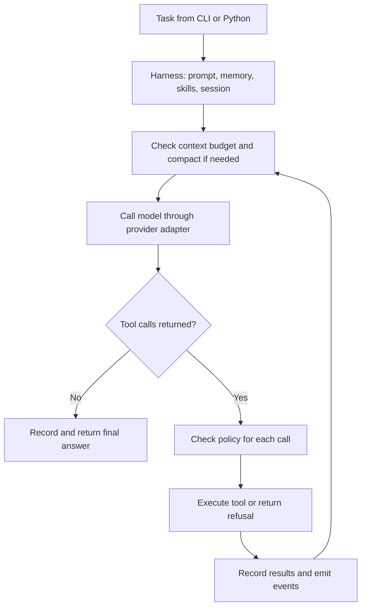

# Sthenos Harness

**A small, extensible Python runtime for AI coding agents, built directly on a model API using only the Python standard library.**

Sthenos turns a natural-language task into a working conversation with tools: the model inspects a project, requests file edits or shell commands, reads the results, and continues until it returns a final answer. The harness supplies the execution loop, tool registry, permission policy, project memory, context compaction, session persistence, sub-agent delegation, and concurrent job runner.

The repository implements this orchestration itself. It calls Anthropic's Messages API directly through `urllib`; it does not invoke another coding agent or use an agent framework. The language model supplies reasoning and code generation, while Sthenos controls how that model interacts with the local environment.

**Current scope:** a terminal application and embeddable Python library for local coding workflows. One provider is implemented today: Anthropic. The provider boundary can be adapted in code, but selecting another vendor is not currently a configuration option.

Read the [detailed architecture review](docs/architecture-review.md) for the design assessment, verified behavior, limitations, and proposed development priorities.

## What the harness does

| Capability | Current behavior | Implementation |
| --- | --- | --- |
| Agent execution | Calls the model, executes requested tools, and feeds results back into the conversation. | [loop.py](Sthenos/loop.py) |
| File and shell tools | Reads, writes, edits, lists, searches, and runs local commands. | [tools.py](Sthenos/tools.py) |
| Tool permissions | Applies `read-only`, `safe`, or `yolo` policy before each registered tool call. | [security.py](Sthenos/security.py) |
| Project memory | Loads `STHENOS.md` into the system prompt and exposes an append-only `remember` tool. | [memory.py](Sthenos/memory.py) |
| Reusable instructions | Advertises local skills and loads their full Markdown instructions on demand. | [skills.py](Sthenos/skills.py) |
| Long conversations | Summarizes older messages above an approximate token threshold. | [context.py](Sthenos/context.py) |
| Session continuation | Appends messages to JSONL files and loads previous conversations with `resume()`. | [session.py](Sthenos/session.py) |
| Sub-agents | Delegates a task to a child with fresh conversation context and returns its final report. | [subagent.py](Sthenos/subagent.py) |
| Concurrent jobs | Runs independent harness instances in a thread pool; returns results in input order. | [fleet.py](Sthenos/fleet.py) |
| Extension and embedding | Combines the components in a reusable `Harness`, with custom tools and event callbacks. | [harness.py](Sthenos/harness.py) |
| Terminal interface | Supports interactive prompts, one-shot tasks, policy modes, model selection, and resume. | [cli.py](Sthenos/cli.py) |

For example, a request to fix a Python function can lead the agent to list files, read the implementation, edit a unique snippet, run the project's tests through the shell tool, inspect failures, and make another edit. These actions are chosen by the model; test execution and task correctness are not automatically enforced by the runtime.

## How a run works



1. **Construct once.** `Harness` resolves the working directory, selects a model and policy, registers tools, and builds a system prompt from base instructions, platform information, project memory, the skill catalog, and optional instructions.
2. **Start or continue.** `run(task)` appends a user message. Repeated calls on the same instance keep the conversation; `resume()` loads a saved one.
3. **Manage context.** Before a model turn, the harness records pending messages and checks whether older history should be summarized.
4. **Ask and act.** The provider translates neutral messages into Anthropic's wire format. Tool calls execute sequentially after policy checks. Unknown tools and ordinary tool exceptions become text results the model can respond to.
5. **Finish.** An answer without tool calls ends the run. At the turn limit, the loop makes one additional model call without tools and asks it to wrap up.

## Quick start

### Requirements

- Python 3. Offline checks were verified with **Python 3.12.14**; the repository does not declare a minimum supported version.
- An Anthropic API key, access to a suitable tool-capable model, and network access to the API for live runs.
- Any language runtimes or external programs needed by the project the agent will work on.

Sthenos itself has **no third-party Python dependencies**. There is currently no package installer metadata or installed console command; run it from the repository root.

```bash
git clone https://github.com/ragu-selva/sthenos-harness.git
cd sthenos-harness
python -m Sthenos --help
```

The package directory is **`Sthenos`**, with a capital `S`. Preserve that capitalization in commands and imports, especially on case-sensitive filesystems.

Set credentials and a model ID available to your account. These are placeholders:

```bash
# macOS / Linux
export ANTHROPIC_API_KEY="your-api-key"
export sthenos_MODEL="your-supported-model-id"
```

```powershell
# Windows PowerShell
$env:ANTHROPIC_API_KEY = "your-api-key"
$env:sthenos_MODEL = "your-supported-model-id"
```

The code fallback is `provider.DEFAULT_MODEL = "claude-sonnet-5"`. This is a repository setting, not a guarantee of model availability; use `-m` or `sthenos_MODEL` to select a model your account supports.

### Run a task

```bash
# Inspect a project with only the three read tools permitted.
python -m Sthenos -d ./my-project --mode read-only -p "Explain this project's structure and entry points."

# Interactive editing: approve calls that require permission.
python -m Sthenos -d ./my-project --mode safe

# Unattended editing and commands for a trusted task/environment.
python -m Sthenos -d ./my-project --mode yolo -p "Add a .gitignore for a Python project."

# Continue the latest saved conversation in this directory.
python -m Sthenos -d ./my-project --resume
python -m Sthenos -d ./my-project --resume --mode yolo -p "Inspect the current files and continue the task."
```

Interactive mode exits on EOF, such as Ctrl-D on Unix-like terminals. Ctrl-C during an interactive `run()` is caught and returns to the prompt. The headless path does not catch Ctrl-C itself, although `Harness.run()` attempts to flush recorded messages in its `finally` block.

### CLI options

| Option | Purpose | Default |
| --- | --- | --- |
| `-p`, `--prompt` | Run one task and exit. | Interactive prompt loop when omitted. |
| `-d`, `--workdir` | Working directory; created if missing. | `.` |
| `-m`, `--model` | Override the model ID. | `sthenos_MODEL`, then `provider.DEFAULT_MODEL`. |
| `--mode` | Choose `read-only`, `safe`, or `yolo`. | `safe` interactively; `yolo` with `-p`. |
| `--resume` | Load the latest session in the working directory. | Start a new conversation. |
| `--max-turns` | Maximum regular model/tool turns per `run()`. | `120`, plus a final wrap-up call if reached. |

Environment-variable names are significant: the API key lookup is **`Sthenos_API_KEY`**, then **`ANTHROPIC_API_KEY`**; the model variable is **`sthenos_MODEL`**.

## Tools and permission modes

| Tool | Behavior |
| --- | --- |
| `read_file(path)` | Reads a file with line numbers, returning at most 4,000 lines. |
| `write_file(path, content)` | Replaces a file completely and creates missing parent directories. |
| `edit_file(path, old, new)` | Replaces an exact snippet only when it occurs once; reports missing or ambiguous matches. |
| `bash(command, timeout="120")` | Runs a shell command from the working directory, with a timeout and truncated output. Uses the platform shell, not necessarily Bash. |
| `list_files(pattern="**/*")` | Lists up to 500 matching files, skipping selected generated directories. |
| `grep(regex, pattern="*")` | Searches file contents, returning up to 200 matches with line numbers. |
| `remember(note)` | Appends a bullet to `STHENOS.md`. |
| `use_skill(name)` | Loads full skill instructions. Registered only if skills exist when the harness is constructed. |
| `spawn_agent(task)` | Runs a child synchronously and returns its final report. Enabled by default. |

`list_files` and `grep` skip `.git`, `node_modules`, `__pycache__`, and `.venv`; they do not implement general `.gitignore` handling.

| Policy mode | `read_file`, `list_files`, `grep` | Other registered tools |
| --- | --- | --- |
| `read-only` | Allowed. | Blocked. |
| `safe` | Allowed. | Require approval; blocked if no approver is supplied. |
| `yolo` | Allowed. | Allowed unless a shell deny pattern matches. |

Shell deny patterns apply in every mode. They recognize selected dangerous command forms, including `sudo`, disk formatting, certain recursive deletions, and force pushes. They are heuristic checks, not comprehensive command analysis.

**Defaults matter:** `Harness()` defaults to `yolo`, while `Policy()` defaults to `safe`. Headless `--mode safe` has no terminal approver, so it blocks every tool outside the three-name read allowlist, including `use_skill` and `spawn_agent`.

**Execution boundary:** these policies do not create an operating-system sandbox. Shell commands retain the Python process's filesystem and network permissions. Direct file reads/writes/edits resolve paths against the working directory, but `grep` can follow file symlinks outside it. Read-only mode also still creates session logs unless persistence is disabled through the Python API. See the [technical review](docs/architecture-review.md#security-and-execution-boundaries) for the current boundaries.

## Use Sthenos from Python

Run examples from the repository root so the `Sthenos` package can be imported.

```python
from Sthenos import Harness, Policy

agent = Harness(
    "./my-project",
    policy=Policy("read-only"),
    max_turns=30,
    budget_tokens=80_000,  # Example compaction threshold, not a spending limit.
    enable_subagents=False,
)
print(agent.run("Explain the project's architecture."))
print(agent.run("Which modules would be affected by adding configuration support?"))
```

Public exports are `Harness`, `Policy`, `Tool`, `tool`, and `run_fleet`. Useful options include:

| `Harness` option | Meaning |
| --- | --- |
| `extra_tools` | Tool-name mapping; matching names replace existing registrations. |
| `system_extra` | Instructions appended to the constructed system prompt. |
| `on_event` | Callback receiving `(kind, payload)` for `assistant`, `tool_start`, and `tool_end` events. |
| `budget_tokens` | Approximate conversation size that triggers compaction; defaults to `600_000`. |
| `max_turns` | Per-run turn limit; defaults to `120`. |
| `session_path` | Custom session path. Loading its history still requires `resume(path)`. |
| `persist` | Whether to write the conversation log; defaults to `True`. |
| `enable_subagents` | Whether to register `spawn_agent`; defaults to `True`. |

The token estimate excludes the system prompt and tool schemas. Choose a threshold below the selected model's actual input limit, allowing room for those inputs and output. It does not enforce a total token or currency budget.

### Add a custom tool

```python
from Sthenos import Harness, Policy, tool

@tool("Count words in supplied text", text="Text to count")
def count_words(text):
    return str(len(text.split()))

agent = Harness(
    ".",
    extra_tools={"count_words": count_words},
    policy=Policy("safe", approver=lambda call, reason: call["name"] == "count_words"),
    enable_subagents=False,
)
print(agent.run("Use count_words to count: small tools make useful agents"))
```

The decorator derives the tool name and required/optional arguments from the function signature. All exposed parameters have JSON Schema type `string`; tools must perform their own conversion and validation. Registration does not sandbox custom Python code.

## Project memory and skills

Place durable knowledge in **`<workdir>/STHENOS.md`**, for example:

```markdown
# Project conventions

- Application code lives in src/.
- Run the standard-library test runner with python -m tests.
- Keep business calculations deterministic and independently testable.
```

`remember` appends notes to this file. Memory and the skill catalog enter the prompt when a `Harness` is **constructed**. Create a new instance to refresh them after external changes; they are not automatically rebuilt before each `run()`.

Skills live at **`<workdir>/skills/<name>/SKILL.md`**. A skill can contain:

```markdown
---
description: Review Python changes for clarity and correctness.
---

# Python review

Read changed functions and their callers. Check edge cases, explain the
behavior change, and run relevant existing tests when permitted.
```

Only names and descriptions are advertised; `use_skill` returns a full file when requested. The front-matter reader extracts a simple `description:` line, not general YAML. Skills supply instructions, not automatically enforced workflows or executable plugin installations.

## Sub-agents and concurrent fleets

| Property | `spawn_agent` | `run_fleet` |
| --- | --- | --- |
| Initiated by | A model tool call. | Application code supplying jobs. |
| Execution | Synchronous; the parent waits. | Concurrent through `ThreadPoolExecutor`. |
| Conversation | Fresh child messages; parent history is not copied. | A separate harness per job. |
| Files | Same directory as the parent. | Directory supplied for each job. |
| Persistence | Children use `persist=False`; their final report enters the parent's conversation. | Controlled by the harness factory. |
| Limits | Two nested child levels by default. | Four workers by default. |

Children inherit the model, policy object, working directory, extra system instructions, event callback, and per-run limits. **Parent `extra_tools` are not automatically passed to children.** Context isolation does not isolate files or shared state.

```python
from Sthenos import Harness, Policy, run_fleet

jobs = [
    {"name": "api-review", "workdir": "./api-project", "task": "Explain the API entry points."},
    {"name": "ui-review", "workdir": "./ui-project", "task": "Explain the UI component structure."},
]

def make_agent(workdir):
    return Harness(workdir, policy=Policy("read-only"), enable_subagents=False)

for result in run_fleet(jobs, make_agent, max_workers=2):
    print(result["name"], result["ok"], result["report"])
```

Each result is `{"name": ..., "ok": ..., "report": ...}`. Ordinary job exceptions become `ok=False` results without aborting other valid jobs. `ok=True` means the job returned without an exception; it does not certify the model's work. Results retain input order. There is no dependency graph, shared-file locking, merge coordination, or global spend budget; use separate directories for concurrent writing jobs.

## Sessions and long-running work

Persistent runs store JSONL conversations under **`<workdir>/.sthenos/sessions/`**. Records contain user messages, assistant responses/tool calls, and tool results. The active conversation can be compacted while the file retains recorded original messages.

`resume()` loads an explicit path or the latest session by filename. The loader stops at an invalid JSON line and fills missing results for the final assistant tool calls with interruption placeholders. It restores conversation structure; it does not roll back files or establish whether an interrupted command already changed them.

Current limitations include no `fsync`, same-second filename collisions for identical task labels, and a confirmed case where continuing a log with a torn line leaves later messages unreadable on subsequent reload. Recovery needs further hardening before being treated as a crash-safe transaction system. See [session findings](docs/architecture-review.md#session-recovery-and-durability).

Compaction uses a character-based estimate, asks the model to summarize older history, and keeps up to six recent messages. Older message text is clipped to 300 characters before summarization; leading orphaned tool results are removed from the retained tail. This saves context but can omit useful details.

## Examples and verification

| Example | Contents |
| --- | --- |
| [Artisan Coffee](products/artisan-coffee/index.html) | Single-file coffee-roaster landing page with embedded styling and JavaScript. |
| [Taskman](products/taskman/taskman.py) | Python task-manager CLI with JSON persistence, `add`, `list`, `done`, `rm`, and `stats`, plus subprocess-based tests. |
| [Viper](products/viper/index.html) | Single-file canvas snake game with scoring, controls, and local storage. |

Run offline checks from the repository root:

```bash
# Harness tests; no API calls.
python -m tests

# Mechanical checks on committed examples; does not regenerate them.
python demos/day5_ship_products_verify.py
```

The documentation review of runtime commit `b8b6309` verified **124 passing harness tests** and **18 passing Taskman tests** on Python 3.12.14. Existing product checks also passed. HTML checks inspect file content and selected markers; they do not establish browser behavior, accessibility, or visual quality. Model-dependent tests use fake provider responses; live API execution was not rerun for this review. A fresh clone displays zero historical product turns because original session logs are not committed.

Other `demos/day*.py` scripts illustrate model calls, memory, skills, crash/resume, delegation, and the fleet build/review process. Most use the live API and can incur usage and modify files. In particular, `day5_ship_products.py` rebuilds example products; use the verification-only script above to check existing outputs.

## Design strengths and current limits

The main strengths are a readable execution loop, separate provider/policy/context components, inspectable Markdown and JSONL state, a small custom-tool interface, and a useful offline test suite. This makes Sthenos a practical foundation for learning how coding agents work and building specialized local agents.

The current implementation has one API provider and no built-in streaming, IDE extension, web dashboard, MCP client, operating-system sandbox, automatic Git worktrees, distributed scheduler, or global cost accounting. It includes no banking or regulatory calculation engine; domain-specific agents require validated tools and instructions supplied by the application.

At runtime commit `b8b6309`, `Sthenos/` contains **14 Python files and 1,287 physical lines**, or **677 nonblank lines after excluding standalone comments and docstrings**. “Under 1,000 implementation lines” is supportable under that counting method; the source tree including tests, examples, and documentation is larger.

The [architecture review](docs/architecture-review.md) prioritizes containment, durable resume, explicit tool metadata, provider/context limits, execution results, and broader verification. The code supports a custom coding-agent runtime claim; broad replacement or production-readiness claims require additional evidence.

## License

[MIT](LICENSE) — Copyright (c) 2026 Ragunath Selvaraj.
